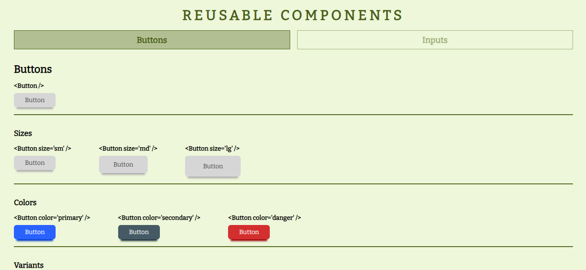
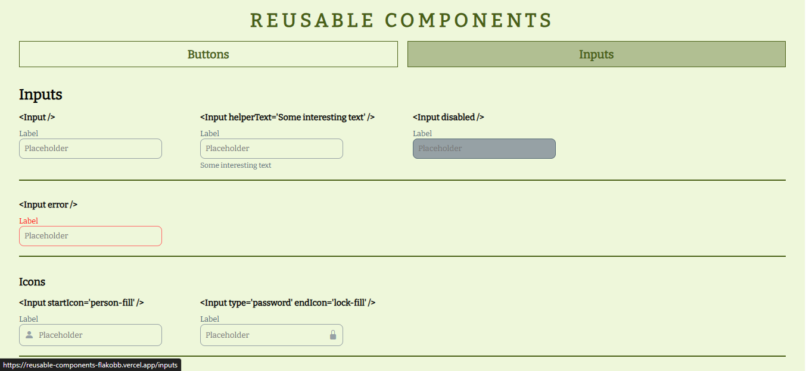

<h1 align="center">Reusable Components</h1>

<div align="center">
   Solution for a challenge from  <a href="http://devchallenges.io" target="_blank">Devchallenges.io</a>.
</div>

<div align="center">
  <h3>
    <a href="https://reusable-components-flakobb.vercel.app/">
      Demo
    </a>
    <span> | </span>
    <a href="https://github.com/FlakoBB/reusable-components">
      Solution
    </a>
    <span> | </span>
    <a href="https://devchallenges.io/challenges/ohgVTyJCbm5OZyTB2gNY">
      Challenge
    </a>
  </h3>
</div>

<!-- TABLE OF CONTENTS -->

## Table of Contents

- [Overview](#overview)
  - [Built With](#built-with)
- [Features](#features)
- [How to use](#how-to-use)
- [Contact](#contact)

<!-- OVERVIEW -->

## Overview

### Button Component


### Input Component


Page that shows a reusable component made with **React**. This component is a button with differents states that change his style.

The demo it is deployed on **Vercel**

### Built With

- [React](https://reactjs.org/)
- [Bootstrap Icons](https://icons.getbootstrap.com/)
- Semantic HTML
- CSS

## Features

This application/site was created as a submission to a [DevChallenges](https://devchallenges.io/challenges) challenge. The [challenge](https://devchallenges.io/challenges/ohgVTyJCbm5OZyTB2gNY) was to build an application to complete the given user stories.

## How To Use

### Button

This React component require some props to render.

When you render the component without props obtains a default button.
```jsx
<Button />
```

To define a text to the button, we'll use the **value** prop.
```jsx
<Button value='Click me' />
```

The Button component has three sizes established to which we will have access from the **size** prop.
```jsx
<Button size='sm' />
<Button size='md' />
<Button size='lg' />
```

It also features three different styles accessible with the **variant** prop.
```jsx
<Button variant='default' />
<Button variant='outline' />
<Button variant='text' />
```

We can also choose between four different colors with the prop **color**.
```jsx
<Button color='default' />
<Button color='primary' />
<Button color='secondary' />
<Button color='danger' />
```

The default button has a box-shadow that we can disable using the **disableShadow** prop.
```jsx
<Button disablShadow />
```

We have the option of put an icon using the props **iconStart** and **iconEnd**. This props recibe a string that corresponding the icon's name provided by **Bootstrap Icons**.
```jsx
<Button iconStart='send-fill'/>
<Button iconEnd='send-fill'/>
```

Also we have access to the button attributes like type (default is 'button'), id, class, disabled and onClick from the props: **type**, **id**, **customClass**, **disabled** and **onClick**
```jsx
<Button type='submit' />
<Button id='btn_send' />
<Button customClass='btn_visit' />
<Button disabled />
<Button onClick={() => {}} />
```

---

### Input

As with the button, we will access the characteristics of the Input through props.

When you render the component without props obtains a default **input**.
```jsx
<Input />
```

To define a label and placeholder we use the **label** and **placeholder** props.
```jsx
<Input label='Username' placeholder='@username_30' />
```

We can put a help text at the bottom using the **helperText** prop.
```jsx
<Input helperText='Min 6 characters' />
```

Also we can define a initial value with the **value** prop.
```jsx
<Input value='Hello World' />
```

We have the possibility of placing an icon to the right or to the left of the input using the **startIcon** and **endIcon** props that receive a string that corresponds to the name of some _Bootstrap_ icon.
```jsx
<Input startIcon='person-fill' />
<Input endIcon='person-fill' />
```

We can choose between 3 specific sizes or put the width at 100% with the **size** prop.
```jsx
<Input size='sm' />
<Input size='md' />
<Input size='lg' />
<Input size='fullWidth' />
```

Also can choose between four colors (blue, green, pink and purple) with the **color** prop.
```jsx
<Input color='blue' />
<Input color='green' />
<Input color='pink' />
<Input color='purple' />
```

We can indicate that the input is multiline using the **multiline** prop and specifying the number of visible lines with the **rows** prop.
```jsx
<Input multiline /> // default: rows='4'
<Input multiline rows='10' />
```

We have the **error** prop that provides the input with a group of different styles useful to validate the field in a form.
```jsx
<Input error />
```

in the same way we have the possibility of deactivating some field using the **disabled** prop.
```jsx
<Input disabled />
```

Finally, we also have access to different attributes of an input.
```jsx
<Input id='user' />
<Input type='password' />
<Input name='description' />
<Input required />
```

---

## Contact

FlakoBB: [Follow me](https://bit.ly/follow-flako)
